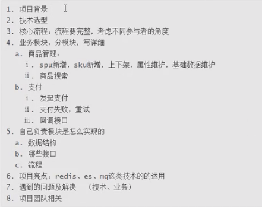
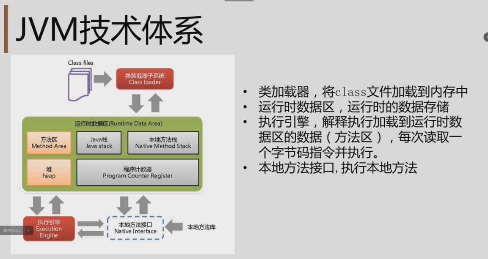
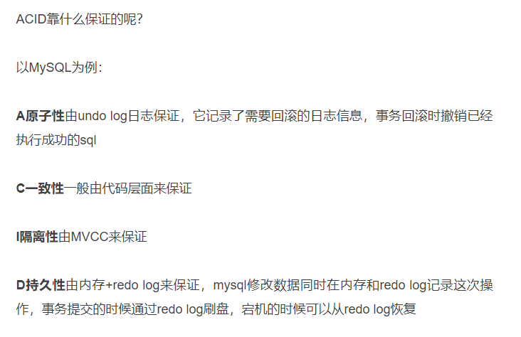
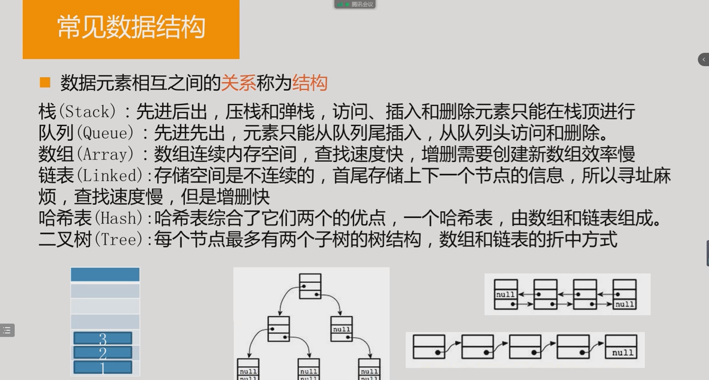
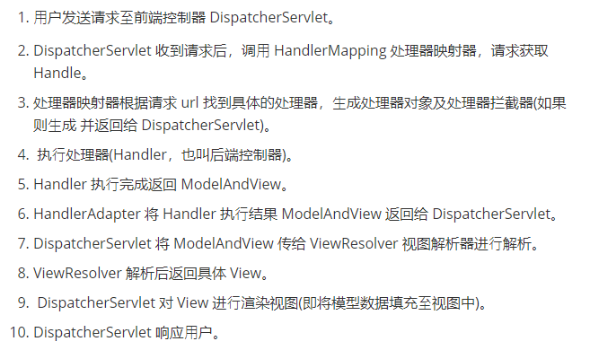
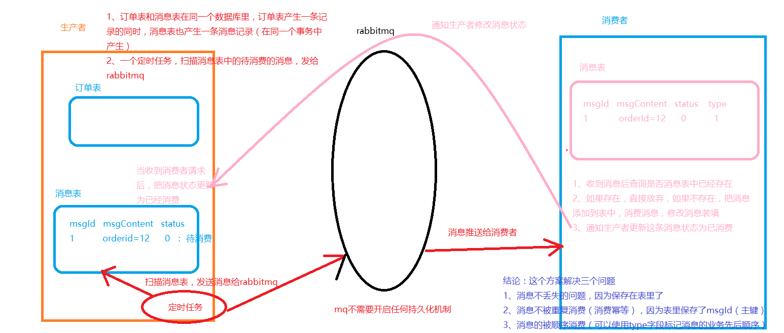

## 一、复习概述


## 二、项目介绍模板



## 三、JVM内部原理


==常量、基本数据类型和引用地址放在栈；引用的对象放在堆。==


### JVM模型图



class文件需要运行的时候，类加载器会把class文件从硬盘中加载到内存中去，后续的操作都在内存中实现。

### 类加载器


### 运行时数据区


### 执行引擎


### GC算法


### GC的概念


### 引用技术法


### 标记-清理法


### 分代管理法


### JVM常用参数


### 监控工具


## 四、Mysql架构


### 架构


### 存储引擎





### SELECT执行顺序


### SQL语句执行过程


### 各种JOIN


### B和B+树

B树：每个节点都存储key和data，所有节点组成这棵树，并且叶子节点指针为null。


B+树：只有叶子节点存储data，叶子节点包含了这棵树的所有键值，叶子节点不存储指针。

在B+树上增加了顺序访问指针，也就是每个叶子节点增加一个指向相邻叶子节点的指针，这样一棵树成了数据库系统实现索引的首选数据结构。 


### 聚簇索引和非聚簇索引

- **聚簇索引（主键索引）：索引和数据保存在一起**。

- **非聚簇索引（非主键索引）：索引的叶子节点上存储的是主键的值，要查询记录的话，还需要根据主键再查询一次。**


### Mysql的主从复制


### 锁的分类


### SQL优化


### 优化的原则


### 优化索引


 


### 索引失效


### 使用过哪些索引

| 普通索引 | 唯一索引 | 复合索引   | 单列索引 |
| -------- | -------- | ---------- | -------- |
| 主键索引 | 聚簇索引 | 非聚簇索引 | /        |


### 关键字Explain


```java
select_type: SELECT 查询的类型
type: join 类型  (最重要)
key: 此次查询中确切使用到的索引
key_len: 使用了索引的字节数
rows: 显示此查询一共扫描了多少行. 这个是一个估计值.rows 也是一个重要的字段. MySQL 查询优化器根据统计信息, 估算 SQL 要查找到结果集需要扫描读取的数据行数.这个值非常直观显示 SQL 的效率好坏, 原则上 rows 越少越好.
filtered: 查询所过滤数据的百分比
extra: 额外的信息
```

## 五、事务

### 事务的特性


### 事务隔离级别


### 事务并发问题


### MVCC


MVCC 多版本并发控制是 「维持一个数据的多个版本，使得读写操作没有冲突」 的概念。

说白了 MVCC 就是为了实现「读-写」冲突不加锁，而这个读指的就是**快照读**，而非当前读。

**当前读**实际上是一种加锁的操作，是悲观锁的实现

### 分布式事务如何实现

使用SpringCloudAlibaba的Seata，Seata支持三种分布式事务方案AT，TCC，SAGA

**我们项目中目前使用的AT模式**

Seata的分布式事务解决方案是业务层面的解决方案，只依赖于单台数据库的事务能力。Seata框架中一个分布式事务包含3中角色：

- **Transaction Coordinator (TC)： 事务协调器，维护全局事务的运行状态，负责协调并驱动全局事务的提交或回滚。**
- **Transaction Manager (TM)： 控制全局事务的边界，负责开启一个全局事务，并最终发起全局提交或全局回滚的决议。**
- **Resource Manager (RM)： 控制分支事务，负责分支注册、状态汇报，并接收事务协调器的指令，驱动分支（本地）事务的提交和回滚。**

其中，TM是一个分布式事务的发起者和终结者，TC负责维护分布式事务的运行状态，而RM则负责本地事务的运行。如下图所示：


**如何使用：**

1、开启seata服务端

2、方法上添加@GlobalTransactional注解

## 六、算法


### 冒泡排序


### 选择排序


### 插入排序


### 快速排序


### 顺序查找


### 二分查找


## 七、设计模式


### 单例模式


### 工厂模式


### 建造者模式


### 代理模式

静态代理和动态代理

静态代理：代理类在编译期就已经确定

动态代理：代理类在JVM运行时动态生成


### 模板模式


### 策略模式


### 装饰器模式


### 观察者模式


### 责任链模式


## 八、集合


### 思维导图


### 常见的数据结构



### 线性表


### 哈希表


### 哈希冲突


### HashMap的实现


### 遍历HashMap

```java
Map<String,String> map = new HashMap<>();
map.put("k1","v1");
map.put("k2","v2");
// keySet 拿到所有的key
for (String key : map.keySet()) {
    System.out.println(key);
}
// values 拿到所有的Value
for (String value : map.values()) {
    System.out.println(value);
}
// entrySet 拿到所有的key和Value
for (Map.Entry<String, String> entry : map.entrySet()) {
    System.out.println(entry.getKey()+":"+entry.getValue());
}
```

### ConcurrentHashMap

jdk 1.7：数组+链表

采用**分段式**锁，锁在segment上。

jdk 1.8：数组+链表+红黑树

内部主要使用CAS在添加节点的时候实现了并发安全性。（CAS：利用CPU硬件指令集控制）

### LinkedHashMap


### HashTable 为什么并发度低

HashTable是线程安全的，内部主要使用synchronized直接锁住整个数组。

### 树


### 树的遍历


### 搜索二叉树


### 红黑树


### Set


### Comparable和Comparator的区别

Comparable 相当于 “内部比较器”，而 Comparator 相当于 “外部比较器”。


### TreeSet的构造方法


### 线程安全集合

| 线程安全                            | 线程不安全 |
| ----------------------------------- | ---------- |
| Hashtable，ConcurrentHashMap        | Hashmap    |
| Vector，Stack，CopyOnWriteArrayList | Arraylist  |

```java
// 使用Collections.synchronizedList方法可以把线程不安全的类转换成线程安全的
List<String> strList = new ArrayList<>();
List<String> threadSafeList = Collections.synchronizedList(strList);
```

## 十、异常


### 异常模型图


### Error和Exception


### Checked和Runtime


### java并发修改异常

```java
List<Integer> list = new ArrayList<Integer>();
list.add(2);
Iterator<Integer> iterator = list.iterator();
while(iterator.hasNext()){
	Integer integer = iterator.next();
	if(integer==2) {
		list.remove(integer);
	}
}
```

运行这段代码会遇到并发修改异常异常

**解决方法：**

使用Iterator的删除方法，不要使用集合本身的删除方法

把上面代码中的`list.remove(integer)` 修改成 ``iterator.remove();  ``就可以了

### 异常处理的方式


### 全局异常

@ControllerAdvice + @ExceptionHandler(value = Exception.class)

```java
@ControllerAdvice
public class GlobalExceptionHandler {
    @ResponseBody
    @ExceptionHandler(value = Exception.class)
    public AjaxResult exceptionHandler(Exception ex){
        return AjaxResult.error(500, "服务端异常（500），请联系管理员");
    }
}
```

### 自定义异常


## 十二、并发

### synchronized

- **锁升级的过程**


- **sychronized 的使用**

```java
public class Test {

    private static int i=0;
    
    public static void main(String[] args) {
        List<String> strList = new ArrayList<>();
        List<String> threadSafeList = Collections.synchronizedList(strList);// Collections工具包
        Test test = new Test();
        test.m3();
    }
    static{
        // 锁在类对象上Test.class
        synchronized (Test.class){}
    }

    // 静态方法的锁是在类对象的Test.class
    public synchronized  static void m1(){
        i++;
    }

    // 普通方法的锁是在实例对象上也就是main方法中的test对象
    public synchronized void m3(){
        i++;
    }

    // 没有synchronized修饰的普通方法，和有synchronized修饰的普通方法不会有锁竞争关系
    public void m4(){
        i++;
    }

    public void m5(){
        // 锁在实例对象上：test对象
        synchronized (this){}
    }
}
```

### Lock

需要自己使用lock.unlock()释放锁，要放在finally块中。Lock是用CAS来实现的。（利用CPU硬件指令集控制。效率比较高。）

- ReentranceLock（可重入锁）
- CyclicBarrier

### synchronzied、Lock对比

| sychronized                | Lock                                                         |
| -------------------------- | ------------------------------------------------------------ |
| 粒度大                     | 粒度小                                                       |
| 1.6 以后也改用CAS来实用    | 使用CAS                                                      |
| 不能设置超时时间，只能等待 | 可以设置超时时间，lock.tryLock(4, TimeUnit.SECONDS)超时后，直接返回false |
| 自动释放锁                 | 要手动释放，lock.unlock                                      |
| 锁升级的过程               | /                                                            |

### CAS

CAS：比较并交换（compare and swap）。**（利用CPU硬件指令集控制。效率比较高。）**

CAS机制当中使用了3个基本操作数：

内存地址V，旧的预期值expect，要修改的新值update。如果内存V中的值是expect，那么修改成功，否则，修改就失败了。

```java
public final boolean compareAndSet(int expect, int update) {
	return unsafe
        .compareAndSwapInt(this, valueOffset, expect, update);
}
```

CAS的缺点：

1. CPU开销较大
   在并发量比较高的情况下，如果许多线程反复尝试更新某一个变量，却又一直更新不成功，循环往复，会给CPU带来很大的压力。
2. 不能保证代码块的原子性
   CAS机制所保证的只是一个变量的原子性操作，而不能保证整个代码块的原子性。比如需要保证3个变量共同进行原子性的更新，就不得不使用Synchronized了。

底层代码：


### AQS

**AQS是JUC多个组件中底层的实现（Lock、CountDownLatch、Semaphore塞姆佛），AQS提供了排他锁和共享锁的机制，比如Lock中的ReentrantLock重入锁就是用了排他锁的机制，CountDownLatch、Semaphore都用到了AQS中共享锁的功能。**

AQS全名：AbstractQueuedSynchronizer，是并发容器J.U.C（java.lang.concurrent）下locks包内的一个类。它实现了一个**FIFO**(FirstIn、FisrtOut先进先出)的队列。底层实现的数据结构是一个**双向链表**。改进版的CLH队列


state代表公共资源的状态，当state=1的时候，说明被某个线程锁定；当state=0的时候，说明没有被锁定，线程可以争抢。

lock锁获取过程是使用CAS操作改变state的值，如果成功，则锁获取成功；如果失败则把节点通过CAS操作加到队列尾部。

对于非公平锁来说，每个线程在入队之前会尝试获取一下锁，如果获取不成功才会入队尾；

进入到队列中的线程会进入阻塞状态。

lock锁的释放过程：当占用锁的线程释放了锁后，会在队列头部寻找有效的节点，唤醒其中的线程去通过CAS争夺锁，当获取锁后，使用资源结束后，会继续唤醒队列中的下一个有效节点。

### 三个并发工具类

**CountDownLatch、CyclicBarrier、semaphore**

- CountDownLatch：多个子线程都执行完毕后，再执行主线程。（加法计数器）

- CyclicBarrier：子线程之间相互等待，大家都准备好后，一起执行。（减法计数器）

- Semaphore：信号量。（获得：semaphore.acquire，释放：semaphore.release）

### ThreadLocal


- 强引用：使用new创建的对象，虚拟机在即使OOM也不会回收，除非这个对象没有任何引用指向它

- 弱引用：垃圾回收一旦发现，就要回收

- 软引用：内存不足就回收

**ThreadLocal垃圾回收的问题：**

1、Thread中有一个ThreadLocalMap

2、ThreadLocalMap的key是ThreadLocal，值是我们自己设定的。

3、ThreadLocal是一个弱引用，当为null时，会被当成垃圾回收

**4、重点来了，突然我们ThreadLocal是null了，也就是要被垃圾回收器回收了，如果线程是在线程池中，那么线程用完是不会被销毁的，但是此时我们的ThreadLocalMap生命周期和Thread的一样，它不会回收，这时候就出现了一个现象。那就是ThreadLocalMap的key没了，但是value还在，这就造成了内存泄漏。**

**解决办法：使用完ThreadLocal后，执行remove操作，避免出现内存溢出情况。**

### 原子类


### CGLib动态代理怎么实现

[CGLib动态代理](https://blog.csdn.net/qq_39038178/article/details/125282017?ops_request_misc=%257B%2522request%255Fid%2522%253A%2522166003432616782390523497%2522%252C%2522scm%2522%253A%252220140713.130102334.pc%255Fall.%2522%257D&request_id=166003432616782390523497&biz_id=0&utm_medium=distribute.pc_search_result.none-task-blog-2~all~first_rank_ecpm_v1~pc_rank_v37-8-125282017-null-null.142^v39^pc_rank_v37,185^v2^control&utm_term=cglib%E5%8A%A8%E6%80%81%E4%BB%A3%E7%90%86%E6%80%8E%E4%B9%88%E5%AE%9E%E7%8E%B0%E7%9A%84&spm=1018.2226.3001.4187)

### 死锁


### 线程状态


### wait和sleep的区别

- sleep 方法是 Thread 类的静态方法，不会释放锁
- wait 是 Object 类的方法，会释放锁

### 创建线程的方法

- 继承Thread类
- 实现Runnable接口
- 实现Callable接口

### Callable

callable是Futrue接收参数的

```java
public class Test {
    public static final ThreadPoolExecutor memberPoolExecutor =
            new ThreadPoolExecutor(5, 50, 
                                   0L, TimeUnit.SECONDS, 
                                   new LinkedBlockingQueue<Runnable>(100));

    public static void main(String[] args) throws Exception {
        Future<String> future = memberPoolExecutor.submit(new Callable<String>() {
            @Override
            public String call() throws InterruptedException {
                // code . . .
                return "返回String";
            }
        });
        String result = future.get();// 这个方法是一个阻塞的方法
        System.out.println("主线程。。。。。。");
        System.out.println(result);
    }
}
```

### 线程池创建方式

**总结：三大方法、7大参数、4种拒绝策略**

**Executors工具类（阿里手册不允许使用）：**

- newFixedThreadPool (固定数目线程的线程池)

- newCachedThreadPool (可缓存线程的线程池)

- newSingleThreadExecutor (单线程的线程池)

- newScheduledThreadPool (定时及周期执行的线程池)

**JUC包:**

- **ThreadPoolExecutor**

7个参数

```java
int corePoolSize // 核心线程数 12个
int maximumPoolSize // 最大线程数 200个
long keepAliveTime // 空闲线程的存活时间
TimeUnit unit // 时间单位
BlockingQueue<Runnable> workQueue // 阻塞队列 200个
ThreadFactory threadFactory // 线程工厂
RejectedExecutionHandler handler // 拒绝策略 4种、默认是不处理并抛出异常
```


### 线程同步的方式

- 通过Object的wait和notify 、notifyAll
- 通过Condition的await和signal（配合Lock使用） ABC  123    A1B2C3
- 通过同步辅助类CountDownLatch 
- 通过同步辅助类CyclicBarrier
- 通过阻塞队列 LinkedBlockingQueue

### 线程和进程

进程：资源分配的基本单位，可以包含很多线程。

线程：更小的执行单位。

### 并发和并行

并发：一个cpu轮流执行多个任务，每个任务执行一小会。

并行：多个cpu同时执行多个任务，是真正意义的同时执行

### 防止超卖

数据库的乐观锁

```sql
update t_boods set stock = stock - 1 where stock >= 1 and goods_id = 123
```

## 十三、Spring

### AOP

**AOP：就是把系统当中的通用的部分抽象出来放在一个统一的地方实现，对方法的增强。**

### IOC

**IOC：控制翻转：把对象的创建以及对象之间依赖关系的组合交给容器管理。**

详细叙述：

Spring 框架的核心是 Spring 容器。容器创建对象，将它们装配在一起，配置它们并管理它们的完整生命周期。Spring 容器使用依赖注入来管理组成应用程序的 组件。容器通过读取提供的配置元数据来接收对象进行实例化，配置和组装的指令

### SpringMVC 执行流程




### SpringMVC 工作原理


### Spring事务支持


### Transactional事务什么时候会失效

- **同一类方法里面调用另一个方法**（解决：把调用的方法写在另一个service中）
- **方法不是 public**
- **异常类型错误**
- **异常被吃捕获**

### Spring事务的传播行为


### Bean的生命周期

- spring读取配置文件，生成BeanDefinition，保存在工厂的BeanDefinitonMap中

- 通过构造函数，创建Bean的实例，接着给属性赋值

- 初始化过程中

  -----调用Aware接口的方法

  -----调用InitializationBean的afterPropertiesSet方法

  -----调用用户自己制定的init方法

- 生成bean实例后放入一级缓存中


### Bean的作用域

- singleton：单例模式，在整个Spring IoC容器中，使用 singleton 定义的 bean 只有一个实例
- prototype：原型模式，每次通过容器的getbean方法获取 prototype 定义的 bean 时，都产生一个新的 bean 实例
- request：对于每次 HTTP 请求，使用 request 定义的 bean 都将产生一个新实例，即每次 HTTP 请求将会产生不同的 bean 实
- session：同一个 Session 共享一个 bean 实例。
- global-session：同 session 作用域不同的是，所有的Session共享一个Bean实例。

### 循环依赖

三级缓存

```java
/** 一级缓存，spring初始化完成后，所有的单例bean都放在这里，是一个线程安全的map */
private final Map<String, Object> singletonObjects = new ConcurrentHashMap<>(256);
	
/** 二级缓存 存储AOP过程中产生的代理对象*/
private final Map<String, Object> earlySingletonObjects = new HashMap<>(16);

/** 三级缓存 value保存的是一个生产bean的工厂 */
private final Map<String, ObjectFactory<?>> singletonFactories = new HashMap<>(16);
```

**如果没有二级可以吗**

如果没有循环依赖和AOP的场景下，二级缓存是不需要的；

只有代理对象，但是没有代理对象之间的循环依赖，二级缓存也可以解决问题

代理对象之间存在循环引用---必须要三级缓存

### SpringBoot自动配置原理

```java
@SpringBootApplication引入了其他两个注解
  --@ComponentScan
  --@EnableAutoConfiguration
    --读取spring-boot-autoconfigure包里面的spring.factories
      --spring.factories里面配置了各种开发场景下的自动化配置的类，XXXAutoConfiguration
      --这些自动化配置的类里面有@Conditional来决定哪些场景配置哪些类
```

### Spring 常⽤注解

@Controller/@ResponseBody

@RestController

@RequestMapping

@RequestParam

@PathVariable

@Service

@Autowried

@Component

### Spring 依赖注入方式 

构造函数注入

setter方法注入

基于注解的注入

### Feign

引入依赖`spring-cloud-starter-openfeign`

```java
@FeignClient(value = "user-service")
public interface UserApi {
    @RequestMapping("findUserByUserId")
    User findUserByUserId(@RequestParam("userId") Long userId);
}

// 启动类开启Feign客户端
@EnableFeignClients
```

### Spring的事务

**编程式事务管理（通过代码实现，不常用）**

**声明式事务管理（可以配置在XML中或用注解@Transactional）**

声明式事务管理建立在AOP之上，其本质是对方法前后进行拦截，然后在目标方法开始之前创建或者加入一个事务，执行完目标方法之后根据执行的情况提交或者回滚。

### 事务的传播机制

- **PROPAGATION_REQUIRED**
  Spring默认的传播机制，能满足绝大部分业务需求，如果外层有事务，则当前事务加入到外层事务，一块提交，一块回滚。如果外层没有事务，新建一个事务执行。
- **PROPAGATION_REQUIRED_NEW**
  该事务传播机制是每次都会新开启一个事务，同时把外层事务挂起，当当前事务执行完毕，恢复上层事务的执行。如果外层没有事务，执行当前新开启的事务即可
- PROPAGATION_SUPPORT
  如果外层有事务，则加入外层事务，如果外层没有事务，则直接使用非事务方式执行。完全依赖外层的事务
- PROPAGATION_NOT_SUPPORT
  该传播机制不支持事务，如果外层存在事务则挂起，执行完当前代码，则恢复外层事务，无论是否异常都不会回滚当前的代码
- PROPAGATION_NEVER
  该传播机制不支持外层事务，即如果外层有事务就抛出异常
- PROPAGATION_MANDATORY
  与NEVER相反，如果外层没有事务，则抛出异常
- PROPAGATION_NESTED
  该传播机制的特点是可以保存状态保存点，当前事务回滚到某一个点，从而避免所有的嵌套事务都回滚，即各自回滚各自的，如果子事务没有把异常吃掉，基本还是会引起全部回滚的。

### 单例、多例？安全性？

**Controller是单例还是多例？如何保证Controller 安全性？**

controller默认是单例的，不要使用非静态的成员变量，否则会发生数据逻辑混乱。

正因为单例所以不是线程安全的。

```java
@Controller
public class ScopeTestController {

    private int num = 0;//定义了实例变量，线程不安全

    @RequestMapping("/testScope")
    public void testScope() {
        System.out.println(++num);
    }

    @RequestMapping("/testScope2")
    public void testScope2() {
        System.out.println(++num);
    }

}
```

**解决方案**

- 不要在controller中定义成员变量。
- 万一必须要定义一个非静态成员变量时候，则通过注解@Scope(“prototype”)，将其设置为多例模式。
- 在Controller中使用ThreadLocal变量

### 自定义注解+aop

自定义注解+aop 判断是否要做权限检查

创建一个springboot工程

pom文件中增加

```xml
<dependency>
	<groupId>org.springframework</groupId>
	<artifactId>spring-aspects</artifactId>
	<version>5.2.13.RELEASE</version>
</dependency>
```

自定义一个注解

```java
@Retention(RetentionPolicy.RUNTIME)//定义注解的使用范围，编译时，还是运行时。。。
@Target(ElementType.METHOD)//定义注解用在哪里class，method。。。
public @interface Login {
    String value() default "";
}
```

定义一个aop的类

```java
@Aspect
@Component
public class MyAop {

    @Pointcut("execution(public * com.org.test.TestController.*(..))")
    public void point(){}

    @Before("point()")
    public void deBefore(JoinPoint joinPoint)  {
        try {
            Class clazz = joinPoint.getTarget().getClass();
            String methodName = joinPoint.getSignature().getName();
            Method method = clazz.getDeclaredMethod(methodName,
                                                    new Class[]{String.class});
            Login loginAnno = method.getAnnotation(Login.class);
            if(loginAnno!=null){
                System.out.println("检查用户是否登录");
            }else{
                System.out.println("不用检查用户是否登录");
            }
        } catch (Exception ex) {
            System.out.println(ex.toString());
        }
    }
}
```

启动类

```java
@SpringBootApplication
@EnableAspectJAutoProxy
public class AopAnnotationApplication {
    public static void main(String[] args) {
        SpringApplication.run(AopAnnotationApplication.class, args);
    }
}
```

controller类

```java
@RestController
public class DemoController {
    @GetMapping("hello1")
    @Login
    public String hello1(String name){
        return "hello1:"+name;
    }
    @GetMapping("hello2")
    public String hello2(String name){
        return "hello2:"+name;
    }
}
```

访问`http://localhost:8080/hello2?name=zhangsan`不需要登录检查

访问`http://localhost:8080/hello1?name=zhangsan`需要登录检查

### 定时任务

- **传统定时器**

```java
@Component
public class Task {
    @Scheduled(fixedRate = 2000)
    public void run1(){
        System.out.println("定时任务");
    }
}

@EnableScheduling // 启动类
```

- **xxl-job**

## 十三、SpringCloud

- 网关：gateway

```yml
spring:
  redis:
    host: localhost
    port: 6379
    password: 
  cloud:
    gateway:
      routes:
        # 系统模块
        - id: ruoyi-system
          uri: lb://ruoyi-system
          predicates:
            - Path=/system/**
          filters:
            - StripPrefix=1
            # 接口限流
            - name: RequestRateLimiter
              args:
                redis-rate-limiter.replenishRate: 1 # 令牌桶每秒填充速率
                redis-rate-limiter.burstCapacity: 2 # 令牌桶总容量
                key-resolver: "#{@pathKeyResolver}" # 使用 SpEL 表达式按名称引用 bean
            
            # 降级配置
            - name: Hystrix
              args:
                name: default
                # 降级接口的地址
                fallbackUri: 'forward:/fallback'
            # 黑名单
            # 白名单
```

- 注册中心 配置中心 nacos

```yml
# Spring
spring: 
  application:
    # 应用名称
    name: ruoyi-xxxx 
  cloud:
    nacos:
      discovery:
        # 服务注册地址
        server-addr: 127.0.0.1:8848
```

- 服务调用 Feign
- 链路追踪 SkyWalking 
- 分库分表 shardingjdbc
- sentinel 熔断降级
- 分布式事务 seata

```txt
如何使用：
1、开启seata服务端
2、方法上添加@GlobalTransactional注解
```

## 十四、Mybatis

### 逻辑分页和物理分页的区别

逻辑分页：把数据从数据库全部查出来，然后在内存中分页

物理分页：使用limit关键字查询

### MyBatis 是否支持延迟加载？延迟加载的原理是什么？

association一对一和collection一对多的时候支持延迟加载，可以通过配置开启。

原理：使用CGLIB...

### #和$的区别

| #    | 预编译，防止sql注入         |
| ---- | --------------------------- |
| $    | 字符串拼接，不能防止sql注入 |

### MyBatis底层原理

mybatis启动的时候，会解析配置文件生成Configuration，当调用查询语句的时候，mybatis会根据UserMapper的全类限定名加上方法名作为key，找到mapper.xml中具体的sql语句，最后执行。

### 两级缓存

Mybatis里面设计了两级缓存来提升数据的检索效率，避免每次数据的访问都需要去查询数据库。

- 一级缓存：默认开启的，每个请求都有自己的一级缓存。
- 二级缓存：要手动开启，多个请求可以共用一个缓存。


## 十五、Redis

### Redis缓存淘汰策略

1. 定期删除：指的是 redis 默认是每隔 100ms 就随机抽取一些设置了过期时间的 key，检查其是否过期，如果过期就删除。
2. 惰性删除：在你获取某个 key 的时候，redis 会检查一下 ，这个 key 如果设置了过期时间那么是否过期了？如果过期了此时就会删除，不会给你返回任何东西。
3. 兜底方案：8种内存淘汰策略：我们采用的是allkeys-lru（对所有 key 随机删除），修改配置文件。

### Redis持久化方式

- RDB：每隔一段时间备份一份完整的数据镜像，好处就是回复数据比较快，缺点就是丢失的数据量比较大。
- AOF：做一次操作都会做一个增量日志，恢复数据就会根据这个日志在做一次操作，好处就是丢失的数据比较小，缺点就是恢复数据比较慢。

### Redis的集群模式

主从配置

优点：搭建简单

缺点：Master节点宕机后，需要人工介入将slave提升为Master


**哨兵模式**

当master宕机后，哨兵会自动从slave中选一个作为新的master


### Redis的数据类型

string（字符串），hash（哈希），list（列表），set（集合）及zset(sorted set：有序集合)

### Redis锁

- **使用SetNX**

- **使用Redisson**

Redisson的特点：

1. 要使用try catch finally自己手动释放锁

2. redission client 有一个看门狗，如果try当中的代码执行时间过长，超过了30秒，redissonClient可以自动续期，保证锁不会消失

3. redisson中大量使用LUA脚本保证多条命令执行的原子性


### 缓存和数据库一致性

**先更新数据库，在删除缓存**

- 可以使用分布式锁，把更新数据库和更新缓存放在一个**原子操作**中，但是要注意，锁的粒度要尽量的小；
- 线程1更新数据库后，把缓存再清除


**缓存穿透**

缓存穿透是指缓存和数据库中都没有的数据，而用户不断发起请求，如发起为id为“-1”的数据或id为特别大不存在的数据。这时的用户很可能是攻击者，攻击会导致数据库压力过大。

==解决措施：==

缓存取不到的数据，在数据库中也没有取到，这时也可以将key-value对写为key-null

**缓存击穿**

缓存击穿是指缓存中没有但数据库中有的数据（一般是缓存时间到期），这时由于并发用户特别多，同时读缓存没读到数据，又同时去数据库去取数据，引起数据库压力瞬间增大，造成过大压力

==解决措施：==

1. 设置热点数据永远不过期。
2. 加互斥锁，互斥锁参考代码如下：

```java
    public TableDataInfo list(Movie movie) {
        Integer pageNum = ServletUtils.getParameterToInt(TableSupport.PAGE_NUM);
        Integer pageSize = ServletUtils.getParameterToInt(TableSupport.PAGE_SIZE);
        String orderByColumn = ServletUtils.getParameter(TableSupport.ORDER_BY_COLUMN);
        String isAsc = ServletUtils.getParameter(TableSupport.IS_ASC);
        Integer movieStatus = movie.getMovieStatus();
        //缓存key
        String redisKey = UserConstants.REDIS_MOVIE_INDEX_PREFIX+pageNum+pageSize+orderByColumn+isAsc+movieStatus;
        //1.从redis中查询，查完直接返回
        List<Movie> cachedMovieList = redisCache.getCacheList(redisKey);
        if(!CollectionUtils.isEmpty(cachedMovieList)){
            return getDataTable(cachedMovieList);
        }
        //加上一把锁,使用setNX设置了超时时间5秒 ，难道就没问题了吗？
        //Redisson 加锁后，watchDog看门狗，开启一个单独的线程，每10秒监视代码是否执行完毕
        //如果没有执行完毕，那么把锁的过期时间再次设置为30秒
        //Redisson特点：
        //a.有看门狗的机制，能自动把锁续期
        //b.需要手动加锁，手动解锁
        RLock lock = redissonClient.getLock("redis_moive_index_cache_lock");
        List<Movie> list = null;
        try {
            lock.lock();
            //2.获得锁之后，再次查询redis，是否有结果
            List<Movie> cachedMovieList2 = redisCache.getCacheList(redisKey);
            if(!CollectionUtils.isEmpty(cachedMovieList2)){
                return getDataTable(cachedMovieList2);
            }
            //3.如果redis中没有，那么直接查询数据库
            startPage();
            list = movieService.selectMovieList(movie);
            //4.把数据库查询的结果放入redis
            redisCache.setCacheList(redisKey, list);
            System.out.println("缓存中没有查到，查询了数据库。。。。");
        }finally{
            //解除锁
            lock.unlock();
        }
        return getDataTable(list);
    }
```

**缓存雪崩**

大量请求缓存中没有的数据，导致请求同时访问数据库，数据库扛不住压力宕机。

==解决措施：==

1. 缓存数据的过期时间设置随机，防止同一时间大量数据过期现象发生。
2. 如果缓存数据库是分布式部署，将热点数据均匀分布在不同搞得缓存数据库中。
3. 设置热点数据永远不过期。


### redisTemplate 常用api

```
redisTemplate.opsForValue.set(key,value)
redisTemplate.opsForValue.setIfAbsent()
redisTemplate.delete(key)
redisTemplate.opsForHash.put(key1,key2,key3)
redisTemplate.opsForSet.members("key")
```

## 十六、RabbitMQ

### 如何使用

```java
@Component
public class RabbitListener{
	@RabbitListener(bindings = {
		@QueueBinding(
			exchange = @Exchange(name = "exchange", type = ExchangeTypes.TOPIC),
			value = @Queue(value = "queue", durable = "true"),
			key = {"routingkey"}
		)
    })
    public void listen(String msg){
        logger.info("接收到消息：" + msg);
    }
}
```

### 应用场景

- 流量削峰
- 异步
- 限流

### 消息不丢失

1、生产者确认模式开启（acknowledge-mode: manual）

2、消费者手动ACK（channel.basicAck）

3、exchange、queue、message开启持久化


### 消息不重复消费

1、生产者确认模式开启

2、消费者手动ACK

3、exchange、queue、message开启持久化


### 消息顺序消费


### 死信队列

DLX（Dead Letter Exchange），**死信交换器**。

当队列中的消息被拒绝、或者过期会变成死信，死信可以被重新发布到另一个交换器，这个交换器就是死刑交换机，与死信交换机绑定的队列称为死信队列。
造成死信的原因：

- 信息被拒绝
- 信息超时
- 超过了队列的最大长度

**过期消息：**

    在 rabbitmq 中存在2种方可设置消息的过期时间，第一种通过对队列进行设置，这种设置后，该队列中所有的消息都存在相同的过期时间，第二种通过对消息本身进行设置，那么每条消息的过期时间都不一样。如果同时使用这2种方法，那么以过期时间小的那个数值为准。当消息达到过期时间还没有被消费，那么那个消息就成为了一个 死信 消息。
    
    队列设置：在队列申明的时候使用 x-message-ttl 参数，单位为 毫秒
    
    单个消息设置：是设置消息属性的 expiration 参数的值，单位为 毫秒

### 延时队列

延迟队列存储的是延迟消息

延迟消息指的是，当消息被发发布出去之后，并不立即投递给消费者，而是在指定时间之后投递。如：

在订单系统中，订单有30秒的付款时间，在订单超时之后在投递给消费者处理超时订单。

rabbitMq没有直接支持延迟队列，可以通过死信队列实现。

在死信队列中，可以为普通交换器绑定多个消息队列，假设绑定过期时间为5分钟，10分钟和30分钟，3个消息队列，然后为每个消息队列设置DLX，为每个DLX关联一个死信队列。

当消息过期之后，被转存到对应的死信队列中，然后投递给指定的消费者消费。

### 总结图

- 保证消息不丢失
- 保证消息不重复消费
- 保证消息的顺序消费（消费者根据业务的要求，根据消息的某些状态字段检查，是否对象的前一个状态的消息被消费过，自己把消息排序）




## 十七、JavaSE

### 常量池


### 基本数据类型


### BigDecimal

```java
add() // 加
subtract() // 减
mulitply() // 乘
divide() // 除
```

### 基本类型


### 引用类型


### 传值和传引用

**Java是值传递：如果是基本数据类型，就是复制一份值传递给形参；如果是引用类型，那就将引用复制一份，传递给形参。形参拿到的始终都是一个副本，因为形参只是操作实参的副本，所以无论如何都无法通过形参改变实参。**

### 浅拷贝和深拷贝

浅拷贝拷贝的是指针，深拷贝拷贝的是堆中具体的对象。

- **浅拷贝**


- **深拷贝**


### 多态

三个前提：继承，重写，向上转型

### 接口和抽象类的区别

| 接口（Interface）                                            | 抽象类（Abstract class）             |
| ------------------------------------------------------------ | ------------------------------------ |
| 可以多继承                                                   | 只能有一个父类                       |
| JDK1.8里，接口也可以定义默认方法，但是在jdk1.8前，接口里面不能定义普通方法 | 可以定义抽象方法，也可以定义普通方法 |
| 接口中不能定义代码块                                         | 可以定义代码块                       |
| 不能有构造方法                                               | 可以有构造方法                       |
| 接口可以包含变量、方法；变量被隐式指定为public static final，方法被隐式指定为public abstract（JDK1.8之前） | public或者protected，默认为public    |

### 抽象类在什么场景下使用

抽象类一般是实现接口，并且把子类的通用实现写在抽象类的方法中，把子类个性化的部分定义成抽象方法，等待子类自己去实现；

```java
public interface Animal {
    void run();
    void talk();
}

public abstract class AbstractAnimal implements Animal{
    @Override
    public void run() {
        System.out.println("动物在跑");
    }
    public  abstract void talk();
}

public class Cat extends AbstractAnimal {
    @Override
    public void talk() {
        System.out.println("猫在喵喵。。。。");
    }
}

public static void main(String[] args)  {
	Animal dog = new Dog();
	Animal cat = new Cat();
	dog.talk();
	cat.talk();
}
```

### ==和equals

重写 hashCode 和 equals

```java
    public int hashCode(){
        int result = 17;
        result = 31 * result + name.hashCode();
        result = 31 * result + age;
        result = 31 * result + passport.hashCode();
        return result;
    }

    
    public boolean equals(Object o){
        if (o instanceof User){
            o.getUserName.equals(this.userName){
                return true;
            }
        }
    }
```

### String用final修饰有什么好处

在 Java 中将 String 设计成不可变的是综合考虑到各种因素的结果，想要理解这个问题，需要综合**内存，同步，数据结构以及安全**等方面的考虑.。

### String、Stringbuffer、Stringbuilder


### 类初始化过程的执行顺序

原则：先静态，后非静态，最后构造函数

```java
static{} // 1.静态
{} // 2.非静态
String(){} // 3.构造函数
```

### break、continue的区别

- break结束循环，之后不执行了；

- continue结束当前循环，继续下一个循环；

### Object有哪些方法

```java
hashCode()
equals(Object obj)
clone() 
toString()
notify()
notifyAll()
wait()
getClass()
finalize() //如果重写了这个方法，虚拟机在做垃圾回收的时候，jvm会调用对象的这个方法
```

### 反射获取对象的方式

```java
// 1. 使用类名.class
Test.class;
// 2. Class.forName()
Class.forName("com.org.email.controller.SendController");
// 3. 通过实例变量.getClass方法
new Test().getClass();
```

### 反射

**通过反射机制，我们可以在运行时加载需要的类，从而动态的改变了程序结构，使我们的程序更加灵活、更加开放。**

```java
@Data
@NoArgsConstructor
@AllArgsConstructor
public class User {
    private Integer userId;
    private String userName;

    public static void main(String[] args) throws Exception {
        Class<?> userClass = Class.forName("com.org.test.User");// 获取对象
        Constructor<?> constructor = userClass.getDeclaredConstructor(new Class[]{});// 获取构造函数
        User user = (User)constructor.newInstance();// 实例化对象
        Field userName = userClass.getDeclaredField("userName");// 获取字段名
        userName.setAccessible(true);// 设置可访问私有字段
        Method m = userClass.getDeclaredMethod("setUserName", String.class);// 获取方法
        m.invoke(user,"Admin");// 代理调用方法
        System.out.println(user);
    }
}
```

## 十八、网络

### get 和 post 请求有哪些区别

GET长度有限制（URL 的最大长度是 2048 个字符），POST对请求长度没有限制。

### forward 和 redirect 的区别

1. 从地址栏显示来说

   forward 是服务器请求资源，服务器直接访问目标地址的URL，把那个URL的响应内容读取过来，然后把这些内容再发给浏览器。浏览器的地址栏还是原来的地址。

   redirect 是服务端根据逻辑，发送一个状态码，告诉浏览器重新去请求那个地址。浏览器的地址栏显示的是新的URL。

2. 从数据共享来说
   forward：转发页面和转发到的页面可以共享request里面的数据。
   redirect：不能共享数据。

3. 从运用地方来说
   forward：一般用于用户登陆的时候，根据角色转发到相应的模块。
   redirect：一般用于用户注销登陆时返回主页面和跳转到其它的网站等。

### cookie 和 session 有什么区别

- cookie保存在浏览器端，有大小限制

- session保存在服务端，session没有大小显示

- session是依赖cookie实现的，session有个sessionid是保存在cookie中的，这个名字叫: JSESSIONID

- 如果浏览器禁止使用cookie，那么JSESSIONID会放在url后边作为一个请求参数

`http://localhost:8080/user/query?JSESSIOINID=dfdsfdsfdsfdsdsfds`


### JWT、Session


### TCP和UDP的区别

- 首先TCP是面向连接的，UDP是无需连接的，TCP有着三握四挥
- TCP保证可靠传输，UDP不保证可靠传输
- TCP是有拥塞控制的，但是UDP没有

### TCP的三次握手


### 两次握手？

如果使用两次握手，当服务器响应客户端的请求后，客户端可能没有收到服务器的响应，这时候，如果服务器已经建立了Socket连接，那么是很浪费资源的。

### 四次挥手


### 用户访问页面的整个流程

- 根据URL中的域名`www.baidu.com`通过DNS解析出IP地址
- 把IP地址转换成MAC地址
- 建立TCP连接
- 发送数据给服务器
- 服务端处理请求后，根据发送方的IP地址，返回响应的数据


## 二十、其他

### Linux

**cp复制**

**mv移动、改文件名** 

**ls 查看目录中的内容**

**ll查看目录中的内容**

chmod 修改文件或目录的权限

chown 修改文件或目录的所有者

**ps 查看系统中有哪些进程**

netstat 查看系统中进程占用的端口

**rm 删除文件或目录**

**cd进入一个目录**

**cat 、 more 查看文件内容 （more可以分屏查看内容）**

**vim、vi 编辑一个文件**

**top查看系统中资源占用情况**

clear清除屏幕

**tail -f 日志文件名**

### Git

| 命令                                          | 描述                                   |
| --------------------------------------------- | -------------------------------------- |
| git add .                                     | 把新的文件和目录添加到git的暂存区      |
| git commit                                    | 把文件提交到本地仓库                   |
| git push                                      | 把本地仓库中的文件提交到远程仓库       |
| git pull                                      | 从远程仓库拉取文件到本地，自动合并冲突 |
| git fetch                                     | 从远程仓库拉取文件到本地，不执行合并   |
| git merge                                     | 合并                                   |
| git reset --hard [版本号] && git push --force | 版本回滚                               |

### Jsp 的 4 种作用域

| 名称        | 作用域               |
| ----------- | -------------------- |
| application | 在所有应用程序中有效 |
| session     | 在当前会话中有效     |
| request     | 在当前请求中有效     |
| page        | 在当前页面有效       |

### NGINX配置反向代理

```xml
    upstream loadbalance { 
      server 127.0.0.1:8081 weight=1; 
      server 127.0.0.1:8082 weight=1; 
      server 127.0.0.1:8080 weight=1;
    }

	server {
		listen       80; #请求的端口
		server_name  demo.loadbalance.com; #请求的域名

		proxy_set_header X-Forwarded-Host $host;
		proxy_set_header X-Forwarded-Server $host;
		proxy_set_header X-Forwarded-For $proxy_add_x_forwarded_for;
			
		location / {
            root   html;
            index  index.html index.htm;
            proxy_pass   http://loadbalance; #把请求转发到上面配置的upstream loadbalance
		}			


	}
```

### ElasticSearch（搜索引擎）

倒排索引的原理

- 把用户输入的文档先分词（IK_MAX_WORD,IK_SMART）
- 记录每个词所在的文档编号，出现的次数，出现在文档中的位置形成一个倒排索引文件。

### 项目中用什么查看日志

```
tail -f 日志文件名
#查看文件最后30行
tail -30f user-service.log
```

### 项目中如何解决跨域访问

@CrossOrigin

在微服务的网关中配一个config类

```java
@Configuration
public class CorsConfig {
    @Bean
    public CorsFilter corsFilter() {

        CorsConfiguration config = new CorsConfiguration();

        //允许跨域的域名
        //响应头中增加这个值Access-Control-Allow-Origin
        config.addAllowedOrigin("http://www.baidu.com");
        config.addAllowedOrigin("http://tieba.baidu.com");
        config.addAllowedOrigin("http://music.baidu.com");

        //允许客户端发送cookie
        config.setAllowCredentials(true);

        //设置跨域有效时间的最大时长，单位是秒
		//config.setMaxAge(2000000L);

        //允许请求的header
        config.addAllowedHeader("*");

        //允许请求的方法
        config.addAllowedMethod("POST");
        config.addAllowedMethod("GET");
        config.addAllowedMethod("PUT");
        config.addAllowedMethod("DELETE");
        config.addAllowedMethod("OPTIONS");
        config.addAllowedMethod("HEAD");

        //允许浏览器访问返回的头中的哪些信息
//        config.setExposedHeaders(Arrays.asList(
//                "Authorization, x-xsrf-token, Access-Control-Allow-Headers, Origin, Accept, X-Requested-With, " +
//                "Content-Type, cache-control,pragma,Access-Control-Request-Method, Access-Control-Request-Headers"));
//        config.setExposedHeaders(Arrays.asList("Authorization"));

        UrlBasedCorsConfigurationSource source = new UrlBasedCorsConfigurationSource();
        source.registerCorsConfiguration("/**", config);

        CorsFilter corsFilter = new CorsFilter(source);

        return corsFilter;
    }
}
```

### JDK8的新特性

- **default关键字：可以在接口中定义默认的实现方法**

```java
public interface UserApi {
    default void defaultMethod(){
        System.out.println("演示一下jdk8中的默认接口");
    }
}
```

- **函数式接口：是只有一个抽象方法的接口，lambda表达ji惠匹配到这个抽象方法。jdk1.8使用@FunctionalInterface注解来定义函数式接口。** [4大函数式接口](https://blog.csdn.net/m0_46493091/article/details/107929578?ops_request_misc=%257B%2522request%255Fid%2522%253A%2522166014837716782246479878%2522%252C%2522scm%2522%253A%252220140713.130102334..%2522%257D&request_id=166014837716782246479878&biz_id=0&utm_medium=distribute.pc_search_result.none-task-blog-2~all~sobaiduend~default-1-107929578-null-null.142^v40^pc_search_integral,185^v2^control&utm_term=4%E5%A4%A7%E5%87%BD%E6%95%B0%E5%BC%8F%E6%8E%A5%E5%8F%A3&spm=1018.2226.3001.4187) 

```java
@FunctionalInterface
public interface MyLambda {
    
    public void test1(String y);
    
	// default方法可以任意定义
    default String test2(){
        return "123";
    }
    
    default String test3(){
        return "123";
    }

	// static方法也可以定义
    static void test4(){
        System.out.println("234");
    }
    
	// 添加2个抽象方法会报错
	// public void test1();

}
```

- **lambda表达式**

```java
List<String> list = Arrays.asList("aaa","fsa","ser","eere");
Collections.sort(list,(o1,o2)->{
    return o2.compareTo(o1);
});
for (String string : list) {
    System.out.println(string);
}
```

- **stream流**

```java
// 略
```

- **新Date工具类**

LocalDate为日期处理类、LocalTime为时间处理类、LocalDateTime为日期时间处理类

### CAP理论

CAP理论作为分布式系统的基础理论,它描述的是一个分布式系统在以下三个特性中：

- 一致性（**C**onsistency）
- 可用性（**A**vailability）
- 分区容错性（**P**artition tolerance）

最多满足其中的两个特性。也就是下图所描述的。分布式系统要么满足CA,要么CP，要么AP。无法同时满足CAP。


### BASE理论

BASE理论是Basically Available(基本可用)，Soft State（软状态）和Eventually Consistent（最终一致性）三个短语的缩写。

- 基本可用（Basically Available）
- 软状态（Soft State）
- 最终一致性（Eventually Consistent）

### 雪花算法


**解决时钟回拨：**

1、[UidGenerator](https://blog.csdn.net/feiying0canglang/article/details/122830153?spm=1001.2014.3001.5506)：Sequence（百度）

2、[Leaf-snowflake](https://blog.csdn.net/qq_30285985/article/details/109024061?spm=1001.2014.3001.5506) ：用到了Zookeeper（美团）

3、[HashMap](https://blog.csdn.net/Wisimer/article/details/115584462?spm=1001.2014.3001.5506)：每毫秒保存最大Id

### TOKEN续期

用户登录成功之后，生成token并设置7天过期，同时在redis里保存这个token设置14天过期，最后返回给前端。

前端发送请求，先会去redis里查询是否有这个key，有的话在验证这个token是否过期。

如果过期的话，重新生成token，再把这个token保存到redis，之后返回给前端新token。

### 项目中遇到过什么问题

**1、雪花算法生成的主键是19位长整型，但是js只能处理16位长整型，最后三位会被截掉。解决方法是把19位整数变成字符串传给前端。**

**2、BigDecimal问题**

```java
BigDecimal param1 = new BigDecimal(0.1);
BigDecimal param2 = new BigDecimal(0.2);
//加法
BigDecimal add = param1.add(param2);
System.out.println("加法：" + add);
 
//减法
BigDecimal subtract = param2.subtract(param1);
System.out.println("减法：" + subtract);
 
//乘法
BigDecimal multiply = param1.multiply(param2);
System.out.println("乘法：" + multiply);
 
//除法
BigDecimal divide = param2.divide(param1);
System.out.println("除法：" + divide);
```


**解决方法：把这个初始化的方法修改为字符串**

```java
 BigDecimal param1 = new BigDecimal("0.1");
 BigDecimal param2 = new BigDecimal("0.2");
```

**3、java并发修改异常**

```java
List<Integer> list = new ArrayList<Integer>();
list.add(2);
Iterator<Integer> iterator = list.iterator();
while(iterator.hasNext()){
	Integer integer = iterator.next();
	if(integer==2) {
		list.remove(integer);
	}
}
```

运行这段代码会遇到并发修改异常异常

**解决方法：**

使用Iterator的删除方法，不要使用集合本身的删除方法

把上面代码中的`list.remove(integer)` 修改成 ``iterator.remove();  ``就可以了


